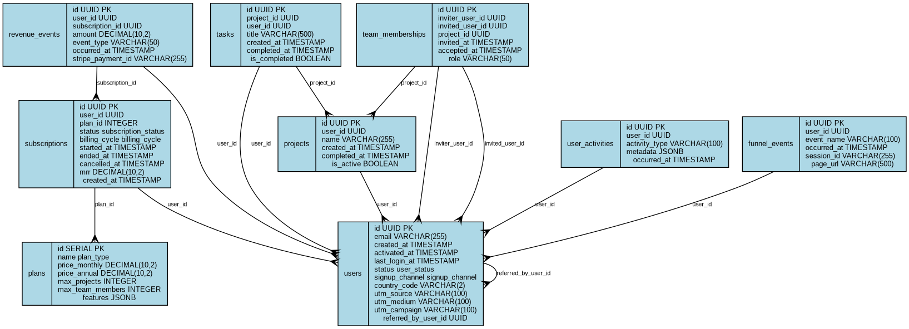

# 📊 SaaS Analytics with PostgreSQL

> **A comprehensive demonstration of how PostgreSQL and SQL queries can answer critical growth and marketing questions for SaaS businesses**

This repository demonstrates the power of PostgreSQL for SaaS analytics by providing a realistic database schema, sample data, and comprehensive SQL queries that answer key growth questions for a project management SaaS application.

**✨ What's New:** Now with **interactive Jupyter notebook** featuring beautiful visualizations! Run everything with a single `docker compose up` command.

The SQL queries included in this project are inspired by a large scale real-world project I developed for an enterprise client.

**You are most welcome to use this code in your commercial projects, all that I ask in return is that you credit my work by providing a link back to this repository. Thank you & Enjoy!**

## ✨ Key Features

- 🐳 **One-Command Setup** - `docker compose up` gets everything running
- 📊 **Interactive Jupyter Notebook** - Visual analytics with Plotly charts
- 🗄️ **Realistic Database** - 1000+ users, 12 months of behavioral data
- 💰 **50+ SQL Queries** - All critical SaaS metrics covered
- 📈 **Beautiful Visualizations** - MRR trends, cohort retention, conversion funnels
- 🎯 **Production-Ready Schema** - Optimized indexes and relationships
- 🌍 **Multi-dimensional Analysis** - Channel, geographic, and plan-based insights


## 🚀 Quick Start

### One-Command Setup with Docker 🐳

**The easiest way to get started:**

```bash
git clone <your-repo-url>
cd postgres_demo
docker compose up
```

That's it! This single command will:
- ✅ Start PostgreSQL with sample data (1000+ users, 12 months history)
- ✅ Launch Jupyter notebook with interactive analytics
- ✅ Set up all necessary Python libraries for visualization
- ✅ Make everything accessible via your browser

**Access the services:**
- 📊 **Jupyter Notebook**: http://localhost:8888 (Interactive analytics dashboard)
- 🗄️ **PostgreSQL**: localhost:5432 (Direct database access)
- 🔧 **pgAdmin** (optional): `docker compose --profile pgadmin up` → http://localhost:8080

### Prerequisites
- Docker and Docker Compose installed
- 2GB free disk space
- Web browser

### Alternative: Manual Setup

If you prefer to install PostgreSQL locally:

```bash
./setup_database.sh
```

This script will:
- ✅ Create a PostgreSQL database with sample data
- ✅ Set up realistic user journeys and subscription patterns
- ✅ Generate schema documentation and diagrams
- ✅ Verify the installation with key metrics

### Manual Setup
If you prefer manual setup:

1. **Create the database:**
   ```sql
   CREATE DATABASE saas_analytics_demo;
   CREATE USER saas_user WITH PASSWORD 'demo_password';
   GRANT ALL PRIVILEGES ON DATABASE saas_analytics_demo TO saas_user;
   ```

2. **Load the schema:**
   ```bash
   psql -U saas_user -d saas_analytics_demo -f schema.sql
   ```

3. **Import sample data:**
   ```bash
   psql -U saas_user -d saas_analytics_demo -f sample_data.sql
   ```

4. **Generate schema diagram:**
   ```bash
   python3 generate_erd.py
   ```

## 🏗️ Database Schema

Our schema models a realistic SaaS project management application with three subscription tiers:

### Core Entities
- **👥 Users** - Customer accounts with signup attribution
- **💳 Subscriptions** - Plan history and billing information  
- **📋 Projects** - User-created projects (core product value)
- **✅ Tasks** - Project tasks (engagement indicator)
- **👫 Team Memberships** - Collaboration features
- **💰 Revenue Events** - All financial transactions
- **📊 Analytics Events** - User behavior tracking

### Subscription Plans
- **🆓 Free** - $0/month (3 projects, 1 team member)
- **⭐ Basic** - $9.99/month (10 projects, 5 team members)
- **🚀 Premium** - $19.99/month (unlimited projects and team members)



## 📊 Interactive Jupyter Notebook

**NEW!** All analytics queries are now available in an interactive, visual Jupyter notebook!

After running `docker compose up`, open your browser to **http://localhost:8888** to access:

- 📊 **Interactive visualizations** with Plotly and Matplotlib
- 🔍 **Step-by-step analysis** of all key SaaS metrics
- 📈 **Beautiful charts** for MRR, churn, conversion, and retention
- 🎯 **Complete conversion funnels** with visual flow
- 🌍 **Geographic and channel performance** analysis
- 💡 **Customer Lifetime Value (LTV)** calculations

The notebook (`notebooks/SaaS_Analytics_Demo.ipynb`) covers:
1. Key Metrics Overview Dashboard
2. Revenue & MRR Analytics  
3. Conversion & Upgrade Analysis
4. Retention & Churn Tracking
5. Engagement & Activation Metrics
6. Marketing Channel Performance
7. Customer Lifetime Value
8. Complete Conversion Funnel

## 📈 Analytics Capabilities

### Revenue Analytics
```sql
-- Monthly Recurring Revenue by Plan
SELECT 
    p.name as plan,
    SUM(CASE 
        WHEN s.billing_cycle = 'monthly' THEN s.mrr
        WHEN s.billing_cycle = 'annual' THEN s.mrr / 12
    END) as monthly_recurring_revenue
FROM subscriptions s
JOIN plans p ON s.plan_id = p.id
WHERE s.status = 'active'
GROUP BY p.name;
```

### Conversion Funnel
```sql
-- Free to Paid Conversion Analysis
WITH conversion_funnel AS (
    SELECT 
        COUNT(DISTINCT u.id) as total_signups,
        COUNT(DISTINCT CASE WHEN s.plan_id != 1 THEN u.id END) as paid_conversions
    FROM users u
    LEFT JOIN subscriptions s ON u.id = s.user_id AND s.status = 'active'
)
SELECT 
    total_signups,
    paid_conversions,
    ROUND(paid_conversions * 100.0 / total_signups, 2) as conversion_rate_pct
FROM conversion_funnel;
```

### Retention Analysis
```sql
-- Cohort Retention by Plan
SELECT 
    DATE_TRUNC('month', u.created_at) as cohort_month,
    p.name as plan,
    COUNT(DISTINCT u.id) as cohort_size,
    COUNT(DISTINCT CASE 
        WHEN u.last_login_at >= DATE_TRUNC('month', u.created_at) + INTERVAL '1 month' 
        THEN u.id 
    END) * 100.0 / COUNT(DISTINCT u.id) as retention_1_month_pct
FROM users u
JOIN subscriptions s ON u.id = s.user_id
JOIN plans p ON s.plan_id = p.id
WHERE s.status = 'active'
GROUP BY DATE_TRUNC('month', u.created_at), p.name
ORDER BY cohort_month DESC;
```

## 📊 Key Metrics Dashboard

Run these queries in `analytics_queries.sql` to get instant insights:

| Metric | Description |
|--------|-------------|
| 💰 **MRR Growth** | Monthly recurring revenue trends |
| 🔄 **Conversion Rates** | Free-to-paid conversion analysis |
| 📉 **Churn Analysis** | Customer retention and churn patterns |
| 👤 **ARPU by Plan** | Average revenue per user segmentation |
| 🎯 **Activation Funnel** | User onboarding and activation rates |
| 🌍 **Geographic Performance** | Revenue and conversion by country |
| 📱 **Channel Attribution** | Marketing channel effectiveness |


## 🎯 Sample Analytics Questions Answered

This database schema and query collection can answer **50+ critical SaaS questions**, including:

### 💸 Revenue Questions
- What's our MRR growth rate by plan?
- Which plan contributes most to revenue?
- What's the average LTV by customer segment?

### 🔄 Conversion Questions  
- What percentage of free users upgrade to paid?
- How long does it take users to upgrade?
- Which features drive plan upgrades?

### 📊 Retention Questions
- How does churn vary by plan?
- What's our cohort retention at 30/60/90 days?
- Which user behaviors predict churn?

### 🚀 Growth Questions
- Which acquisition channels bring the best customers?
- Where are the biggest funnel drop-offs?
- How do engagement patterns differ by plan?

*See [`key_questions.md`](key_questions.md) for the complete list of analytics questions.*

## 📁 File Structure

```
postgres_demo/
├── 📄 README.md                 # This file
├── 📊 key_questions.md          # Comprehensive list of analytics questions
├── 🗄️ schema.sql               # Complete PostgreSQL schema
├── 📋 sample_data.sql           # Realistic sample data generation
├── 🔍 analytics_queries.sql     # 50+ analytical SQL queries
├── 🖼️ generate_erd.py          # Schema diagram generator
├── ⚙️ setup_database.sh         # One-command setup script
├── 🔗 docker-compose.yml        # Docker setup (optional)
└── 📈 schema_diagram.png        # Visual database schema
```

## 🐳 Docker Alternative

For a completely isolated setup using Docker:

```bash
# Start PostgreSQL with Docker
docker-compose up -d

# Run setup (connects to Docker instance)
./setup_database.sh
```

## 🔧 Customization

### Adding New Metrics
1. **Extend the schema** in `schema.sql` with new tables or columns
2. **Update sample data** in `sample_data.sql` to populate new fields
3. **Write queries** in `analytics_queries.sql` to analyze the new data
4. **Regenerate ERD** with `python3 generate_erd.py`

### Modifying Plans
Edit the plans table in `schema.sql`:
```sql
INSERT INTO plans (name, price_monthly, price_annual, max_projects, max_team_members, features) VALUES
('enterprise', 49.99, 499.90, -1, -1, '{"priority_support": true, "sso": true, "custom_integrations": true}');
```

### Real-World Integration
- Replace sample data with actual customer data
- Connect to your existing user authentication system
- Integrate with payment processors (Stripe, PayPal, etc.)
- Add ETL processes for ongoing data updates

## 📚 Learn More

### Recommended Reading
- [SaaS Metrics 2.0](https://www.forentrepreneurs.com/saas-metrics-2/) - David Skok's comprehensive SaaS metrics guide
- [The SaaS Growth Playbook](https://www.coelevate.com/essays/saas-growth-playbook) - Growth strategies and metrics
- [PostgreSQL Performance Tuning](https://www.postgresql.org/docs/current/performance-tips.html) - Optimizing analytical queries

### Advanced Topics
- **Time-series analysis** for trend detection
- **Cohort analysis** for retention insights  
- **Predictive modeling** for churn prevention
- **Real-time dashboards** with materialized views
- **Data warehousing** patterns for analytics at scale

## 🤝 Contributing

We welcome contributions! Here's how you can help:

1. **🐛 Report issues** - Found a bug or have a suggestion?
2. **📝 Improve queries** - More efficient SQL or additional analytics
3. **📊 Add metrics** - New KPIs or industry-specific measurements
4. **🔧 Enhance tooling** - Better setup scripts or visualization tools

### Development Setup
```bash
git fork <repo-url>
git clone <your-fork>
cd postgres_demo

# Make your changes
# Test thoroughly
git commit -m "Add new churn prediction query"
git push origin feature/churn-prediction

# Open a pull request
```


---

**⭐ Kindly star this repository if it helped you understand SaaS analytics with PostgreSQL, Thanks & much appreciated, Warm regards, Danny.**